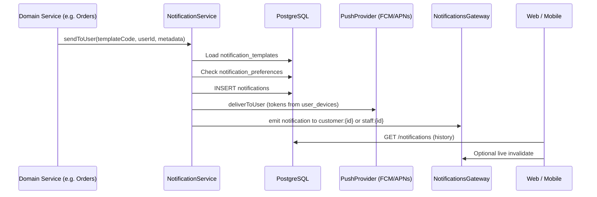

# FoodApp Notification Architecture

FoodApp owns notification **business logic**, **history**, **templates**, **delivery rules**, and the **in-app notification center**. Firebase Cloud Messaging (FCM) and Apple Push Notification service (APNs) are **transport only** — they never create or store notifications.

## Principles

1. **Backend-only creation** — Clients list, mark read, and register devices. They must never `POST` notification content.
2. **Database first** — Every event writes to `notifications` (history) before any push attempt.
3. **Template-driven** — Copy and types come from `notification_templates`, not hardcoded in mobile/web.
4. **Provider pattern** — `PushProvider` abstracts FCM/APNs; switch via `PUSH_PROVIDER` env (`noop` | `firebase` | `apns`).
5. **Real-time ready** — WebSocket namespace `/notifications` emits `notification` after DB write; polling remains the fallback.

## Database Schema

### `notification_templates`

| Column     | Description                                      |
|-----------|--------------------------------------------------|
| id        | UUID                                             |
| code      | Unique key, e.g. `ORDER_ACCEPTED`                |
| title     | Default title (Uzbek), supports `{{placeholders}}` |
| body      | Default body                                     |
| type      | `NotificationChannelCode` enum                   |
| createdAt | Timestamp                                        |

Seeded codes include customer order lifecycle, `PROMOTION`, `SYSTEM`, and staff/courier/manager codes (`NEW_ORDER`, `ORDER_ASSIGNED`, `ORDER_PROBLEM`, `DAILY_REPORT`).

### `notifications` (history)

| Column       | Description |
|-------------|-------------|
| id          | UUID        |
| userId      | `Customer.id` or `User.id` (staff) |
| accountType | `CUSTOMER` \| `STAFF` |
| title, body | Rendered from template (+ optional overrides) |
| type        | Channel code enum |
| isRead      | In-app read state |
| metadata    | JSON (`orderId`, `orderNumber`, …) |
| createdAt   | Timestamp |

Indexes: `(userId, accountType, isRead)` and `(userId, accountType, createdAt DESC)`.

### `user_devices`

Registers devices for **push transport** only.

| Column      | Description |
|------------|-------------|
| userId + accountType + deviceId | Unique device per account |
| pushToken  | FCM/APNs token |
| platform   | `android` \| `ios` \| `web` |
| appVersion | Optional |
| lastSeenAt | Updated on register |

### `notification_preferences`

Per-user, per-type toggles (`enabled`, `pushEnabled`). Missing row = defaults to enabled.

## Event Flow



### Order lifecycle (customer)

| Order status        | Template code      |
|--------------------|--------------------|
| PENDING (on create)| ORDER_CREATED      |
| ACCEPTED           | ORDER_ACCEPTED     |
| PREPARING          | ORDER_PREPARING    |
| COURIER_ASSIGNED / PICKED_UP | ORDER_READY |
| DELIVERING         | ORDER_DELIVERING   |
| DELIVERED          | ORDER_COMPLETED    |
| CANCELLED          | ORDER_CANCELLED    |

Triggered from `OrdersService` via `emitOrderStatusNotifications()` — not from clients.

### Staff / manager / courier

| Event              | Template        | Recipients                    |
|-------------------|-----------------|-------------------------------|
| New guest order   | NEW_ORDER       | SUPER_ADMIN + MANAGER users   |
| Courier assigned  | ORDER_ASSIGNED  | Courier's `User.id`           |

`AdminNotification` (legacy panel feed) remains separate; staff also receive FoodApp `notifications` rows for mobile/manager apps later.

## API Surface

### Customer (`CustomerJwtAuthGuard`)

| Method | Path | Purpose |
|--------|------|---------|
| GET | `/api/v1/notifications` | History |
| GET | `/api/v1/notifications/unread-count` | Badge |
| PATCH | `/api/v1/notifications/:id/read` | Mark one read |
| POST | `/api/v1/notifications/read-all` | Mark all read |
| POST | `/api/v1/notifications/devices` | Register push token |

### Staff (`JwtAuthGuard` + roles)

Same operations under `/api/v1/notifications/staff/*`.

## Push Provider Architecture

```text
NotificationService
       │
       ▼
PushDeliveryService ──► PushProvider (injected)
                              ├── NoopPushProvider (default)
                              ├── FirebasePushProvider (FCM)
                              └── ApplePushProvider (APNs stub)
```

Configure:

```env
PUSH_PROVIDER=noop          # development
PUSH_PROVIDER=firebase      # requires FIREBASE_PROJECT_ID (+ credentials when wired)
PUSH_PROVIDER=apns          # future native iOS
```

`FirebasePushProvider` logs or sends via `firebase-admin` when credentials exist; **failed push does not roll back** the DB notification.

## Real-Time Layer

- **WebSocket**: `io({ path: '/notifications', auth: { token } })` — customer JWT auto-joins `customer:{customerId}`; staff JWT joins `staff:{userId}`.
- **SSE**: Not implemented; same events can be exposed on `GET /notifications/stream` later without changing `NotificationService`.
- **Polling**: Web/mobile refetch every 30s as fallback.

## Client Apps

| App | Notification Center | Unread badge |
|-----|---------------------|--------------|
| Web (`frontend`) | `/notifications` | Profile menu |
| Customer mobile | `/notifications` route | Profile tile |
| Courier mobile | Future — staff API + `ORDER_ASSIGNED` |
| Manager mobile | Future — staff API + `NEW_ORDER` |
| Admin web | Existing admin-notifications bell (panel); staff FoodApp feed optional |

## Future: Courier & Manager Mobile

1. Authenticate with staff JWT.
2. `POST /notifications/staff/devices` with platform + FCM token.
3. `GET /notifications/staff` + WebSocket `joinStaff`.
4. Extend `OrdersService` / ops modules to call `notifyStaff({ templateCode: 'ORDER_PROBLEM' })`.

Courier pool broadcast (all online couriers for `NEW_ORDER`) can use `sendToMany()` with a query on `couriers.isOnline`.

## Scaling Strategy

1. **Write path** — Keep `NotificationService` synchronous per user; for high volume, enqueue `sendToUser` jobs (Bull/Redis) without changing the public API.
2. **Read path** — Cursor pagination on `notifications`; archive rows older than N days to `notifications_archive`.
3. **Push** — Batch FCM multicast per notification id; rate-limit per `user_devices`.
4. **WebSocket** — Horizontal scale with Redis adapter for Socket.IO rooms (`customer:*`, `staff:*`).
5. **Templates** — Admin UI to edit `notification_templates` without deploys; cache templates in Redis.

## Module Layout (backend)

```text
backend/src/modules/notifications/
  notifications.service.ts      # NotificationService
  notifications.controller.ts   # Customer HTTP
  staff-notifications.controller.ts
  notifications.gateway.ts      # WebSocket
  push/
    push-provider.interface.ts
    push-delivery.service.ts
    firebase-push.provider.ts
    apple-push.provider.ts
    noop-push.provider.ts
```

## Related Docs

- Order WebSocket tracking: `namespace: /orders`
- Admin panel feed (separate table): `admin_notifications` — not replaced by this system
