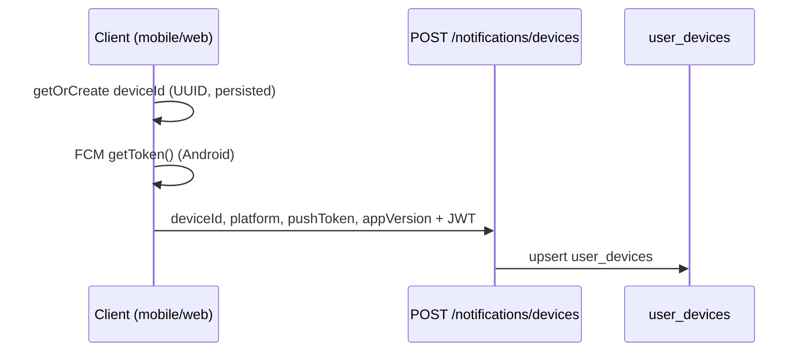
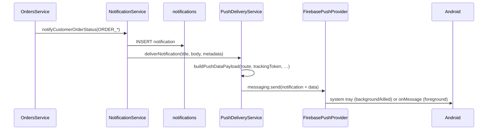

# FoodApp Push Delivery Report

Production push delivery for Android (customer app) with FoodApp-owned registration, history, and deep linking. Firebase is **transport only**.

## 1. Registration Flow



### Customer

| Step | Mobile (`customer_mobile`) | Web |
|------|---------------------------|-----|
| Login | `_persist()` → `DeviceRegistrationService.registerAfterAuth()` | `persistCustomerSession()` → `registerCustomerDevice()` |
| App start (logged in) | `PushBootstrap` → register + token refresh listener | Page load with token → optional register |
| Logout | `unregisterOnLogout()` clears push token | `clearCustomerSession()` → unregister |

**API:** `POST /api/v1/notifications/devices`  
**Body:** `{ deviceId, platform: android|ios|web, pushToken?, appVersion? }`

### Courier / Manager / Staff

Same flow with staff JWT:

**API:** `POST /api/v1/notifications/staff/devices`

Registered after `StaffLoginForm` success (`registerStaffDevice()`). Courier and manager panels use web today; native apps will call the same staff endpoints with `platform: android|ios`.

## 2. Token Lifecycle

| Event | Action |
|-------|--------|
| First login | Create `deviceId`, request FCM token, upsert `user_devices` |
| FCM `onTokenRefresh` | Re-POST register with new `pushToken` |
| Invalid token on send | Backend clears `pushToken` for that row (`InvalidPushTokenError`) |
| Logout | `POST .../devices/unregister` sets `pushToken` null (device row kept) |
| Reinstall | New `deviceId` unless backup restored → new row |

**Stable device id:** `SharedPreferences` / `localStorage` key `foodapp_device_id`.

## 3. Delivery Flow



### Order events verified (customer templates)

| Template | Trigger |
|----------|---------|
| `ORDER_CREATED` | Guest order placed + linked `customerId` |
| `ORDER_ACCEPTED` | Status → ACCEPTED |
| `ORDER_PREPARING` | Status → PREPARING |
| `ORDER_READY` | COURIER_ASSIGNED / PICKED_UP |
| `ORDER_DELIVERING` | Status → DELIVERING |
| `ORDER_COMPLETED` | Status → DELIVERED |
| `ORDER_CANCELLED` | Status → CANCELLED |

Metadata includes `orderId`, `orderNumber`, **`trackingToken`** for deep links.

### FCM payload shape (transport)

- **`notification`**: `{ title, body }` — OS displays when app is backgrounded or terminated
- **`data`**: string map — `notificationId`, `type`, `route`, `trackingToken`, …
- **Android**: channel `foodapp_default`, priority `high`

### Backend configuration

```env
PUSH_PROVIDER=firebase          # optional; auto if credentials set
FIREBASE_PROJECT_ID=your-project
FIREBASE_SERVICE_ACCOUNT_JSON={"type":"service_account",...}  # single-line JSON
# or GOOGLE_APPLICATION_CREDENTIALS=/path/to/key.json
```

Implementation: `backend/src/modules/notifications/push/firebase-push.provider.ts` (`firebase-admin`).

## 4. Deep Linking Flow

Backend resolves route in `push-payload.util.ts`:

| Notification type | `data.route` |
|-------------------|--------------|
| `ORDER_*` + `trackingToken` | `/track/{trackingToken}` |
| `ORDER_*` (no token) | `/notifications` |
| `PROMOTION` | `/promotions` |
| Other | `/notifications` |

### Android (customer_mobile)

| App state | Behavior |
|-----------|----------|
| **Terminated** | `getInitialMessage()` → `navigateFromPushData()` |
| **Background** | `onMessageOpenedApp` → tracking / promotions route |
| **Foreground** | `flutter_local_notifications` shows tray; tap → payload → same navigation |

Routes: `OrderTrackingScreen`, `PromotionsScreen`, `NotificationsScreen`.

### Web

`navigateFromNotificationRoute(route)` → `window.location.href`.

Pages: `/track/[token]`, `/promotions`, `/notifications`.

## 5. Offline / Background / Terminated

| State | User sees notification? | In-app history? |
|-------|------------------------|-----------------|
| Foreground | Local notification + optional handler | Yes (DB + center) |
| Background | FCM `notification` payload in tray | Yes |
| Terminated | FCM `notification` payload in tray | Yes |
| Offline at send time | Delivered when device online (FCM queue) | Yes (already in DB) |

History is always written **before** push; Notification Center works without FCM.

## 6. Android Project Setup (required for production)

1. Create Firebase project → add Android app (package name from `flutter create`).
2. Download `google-services.json` → `apps/customer_mobile/android/app/`.
3. Run `flutterfire configure` or add Gradle plugin per [FlutterFire docs](https://firebase.flutter.dev/docs/overview).
4. Build with Firebase initialized (`Firebase.initializeApp()` in `FirebasePushNotificationService`).

Without `google-services.json`, app runs but FCM token stays null (registration stores device without token).

## 7. Future iOS Requirements

- Add iOS app in Firebase → `GoogleService-Info.plist`
- `platform: ios` on register
- Enable APNs key in Firebase console
- `ApplePushProvider` for native APNs if not using FCM on iOS
- Request iOS notification permissions (already in `requestPermission()`)

## 8. Future Courier / Manager Requirements

| App | Auth | Register endpoint | Deep links |
|-----|------|-------------------|------------|
| `courier_mobile` | Staff JWT | `/notifications/staff/devices` | Order assign → courier order detail |
| `manager_mobile` | Staff JWT | same | `NEW_ORDER` → admin order |

Broadcast `NEW_ORDER` to online couriers: `NotificationService.sendToMany()` with courier user ids.

## 9. Verification Checklist

- [ ] `FIREBASE_*` env set on API; `PUSH_PROVIDER=firebase`
- [ ] Customer logs in on Android emulator/device → row in `user_devices` with `push_token`
- [ ] Place order → `ORDER_CREATED` push + DB row
- [ ] Advance order in admin → each status push with correct Uzbek copy
- [ ] Tap push from killed app → order tracking opens
- [ ] `PROMOTION` test notification → `/promotions`
- [ ] Invalid token removed from DB after failed send

## 10. File Reference

| Layer | Path |
|-------|------|
| FCM send | `backend/.../firebase-push.provider.ts` |
| Payload / routes | `backend/.../push-payload.util.ts` |
| Device API | `backend/.../notifications.controller.ts` |
| Mobile FCM | `apps/customer_mobile/lib/core/push/firebase_push_notification_service.dart` |
| Mobile register | `apps/customer_mobile/lib/core/push/device_registration_service.dart` |
| Web register | `frontend/src/lib/device-registration.ts` |
| Architecture | `NOTIFICATION_ARCHITECTURE.md` |
